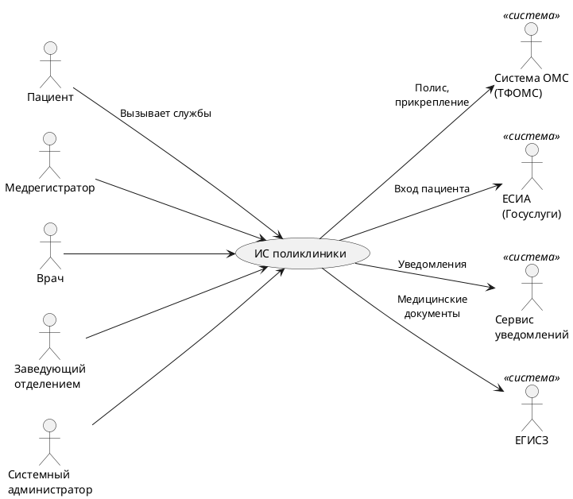

# Видение
## Даты внесения изменений
| Версия | Дата | Описание | Автор |
--- | --- | --- | --- |
| Черновой начальный вариант | 18 сентября, 2026 | Первый черновой вариант. Будет уточнен на стадии развития | Команда 3, БСБО-11-24 |

## Введение
Нам видится информационная система поликлиники (ИС «Поликлиника»), построенная по образцу ЕМИАС. Система ведет прикрепление пациентов к поликлинике по полису ОМС, дает записаться на прием к врачу через портал, мобильное приложение, инфомат или регистратуру, учитывает факт приема и ведет электронную медицинскую карту (ЭМК) пациента. Для проверки полисов, входа пациентов и передачи медицинских документов система обменивается данными с внешними государственными системами. Анализ в этом документе носит учебный характер.

## Позиционирование

### Экономические предпосылки
Во многих поликлиниках до сих пор ведут бумажные амбулаторные карты и журналы записи. Карты теряются или не доходят до кабинета к началу приема. Записаться можно только в окне регистратуры или по телефону, и поэтому утром у регистратуры собираются очереди. Факты приема отмечаются в бумажных талонах, поэтому статистику посещений собирают вручную и с ошибками. Нагрузку на врачей и число неявок никто не считает, поэтому расписание составляется "на глаз". Опыт ЕМИАС показывает, что электронная запись и ЭМК снимают большую часть этих проблем.

### Формулировка проблемы
Бумажный документооборот и ручная запись приводят к очередям, потере медицинских данных, ошибкам в учете оказанных услуг и неравномерной загрузке врачей. От этого страдают пациенты, медрегистраторы, врачи, заведующие отделениями и администрация поликлиники.

### Место системы
Система предназначена для городской поликлиники (включая ее филиалы), ее пациентов и сотрудников. В отличие от ЕМИАС, которая объединяет сотни учреждений города, наша система обслуживает одну поликлинику, но работает по тем же принципам: пациент записывается сам, медицинская карта ведется в электронном виде, данные сверяются с ОМС и передаются в ЕГИСЗ.

## Заинтересованные лица

Пользователи системы: пациенты, медрегистраторы, врачи, заведующие отделениями, системные администраторы.

Заинтересованные лица, не являющиеся пользователями системы:
- администрация поликлиники (главный врач) отвечает за доступность помощи и отчетность;
- ТФОМС ведет реестр застрахованных граждан и сведения о прикреплении к поликлиникам;
- Минздрав России (через ЕГИСЗ) собирает медицинские документы;
- региональный департамент здравоохранения контролирует сроки ожидания приема.

Основные задачи высокого уровня и проблемы заинтересованных лиц

| Цель высокого уровня | Приоритет | Проблемы и замечания | Текущие решения |
--- | --- | --- | --- |
| Быстрая запись на прием без очередей | Высокий | Запись только в регистратуре и по телефону, телефон постоянно занят. Пациент не видит свободное время врачей. Отменить запись сложно, поэтому растет число неявок | Бумажный журнал записи, талоны в окне регистратуры |
| Полная и доступная медицинская карта | Высокий | Бумажная карта теряется или остается в регистратуре. Записи разных врачей трудно читать и сопоставлять. Пациент не может посмотреть результаты своих приемов | Бумажная амбулаторная карта (форма 025/у) |
| Точный учет фактов приема | Высокий | Факты приема фиксируются на бумаге, статистика посещений и отчетность собираются вручную и с ошибками. По бумажным записям нельзя быстро понять, был ли пациент на приеме | Бумажные талоны пациента, ручной подсчет посещений |
| Актуальный учет прикрепленного населения | Средний | Заявления о прикреплении и откреплении обрабатываются на бумаге, сверка с ТФОМС идет с задержкой | Бумажные заявления, выгрузки из ТФОМС |
| Равномерная загрузка врачей | Средний | Нет данных о загрузке и неявках, расписание составляется без их учета | Расписание в таблицах Excel |

### Задачи уровня пользователя
Пользователи (и внешние системы) используют данную систему в таких целях.

- Пациент. Записывается на прием, отменяет или переносит запись, встает в лист ожидания, просматривает свою медицинскую карту.
- Медрегистратор. Прикрепляет пациентов к поликлинике и открепляет их, записывает на прием при личном обращении и по телефону.
- Врач. Проводит прием: отмечает факт приема или неявку, вносит запись в ЭМК (жалобы, осмотр, диагноз), выдает направления.
- Заведующий отделением. Составляет и корректирует расписание врачей отделения.
- Системный администратор. Управляет учетными записями сотрудников, их ролями и справочниками.
- Система ОМС (ТФОМС). Подтверждает действие полиса ОМС пациента, принимает сведения о прикреплении и откреплении.
- ЕСИА (Госуслуги). Подтверждает личность пациента при входе на портал.
- Сервис уведомлений. Доставляет пациенту SMS и push-уведомления о записи и напоминания о приеме.
- ЕГИСЗ. Принимает структурированные медицинские документы (СЭМД) о проведенных приемах.

### Окружение
Рабочие места врачей и медрегистраторов это компьютеры в локальной сети поликлиники. В холлах стоят инфоматы. Пациенты работают с системой через веб-портал и мобильное приложение. Внешние системы подключаются по защищенным каналам.

## Обзор

### Перспективы продукта

Система устанавливается в поликлинике и ее филиалах. Она обслуживает пользователей и взаимодействует с внешними системами, как показано на рис. Видение 1.

Рис. Видение 1. Контекстная диаграмма ИС поликлиники

### Преимущества системы

| Свойство | Преимущества заинтересованных лиц |
 --- | --- |
| Самостоятельная запись на прием через портал, приложение и инфомат | Меньше очередей в регистратуре, пациент выбирает удобное время сам |
| Лист ожидания и напоминания о приеме | Меньше неявок, освободившиеся слоты быстро занимают другие пациенты |
| Электронная медицинская карта | Врач видит всю историю болезни, карта не теряется, пациент может посмотреть свои данные |
| Автоматический учет фактов приема | Достоверная статистика посещений и отчетность без ручного подсчета |
| Проверка полиса ОМС при прикреплении | Пациент прикрепляется по действующему полису, данные о прикреплении совпадают с ТФОМС |
| Передача медицинских документов в ЕГИСЗ | Соответствие требованиям законодательства без ручной работы |

Предположения и зависимости: ТФОМС предоставляет сервис проверки полиса; ЕСИА доступна для подключения; у поликлиники есть лицензия на подключение к ЕГИСЗ.

Лицензирование и установка ...

## Основные свойства системы

- Прикрепление пациентов к поликлинике и открепление с проверкой полиса ОМС.
- Ведение расписания врачей: рабочие смены, слоты приема, типы приема (первичный, повторный, по направлению).
- Запись на прием через портал, мобильное приложение и инфомат, а также в регистратуре.
- Лист ожидания, если свободных слотов нет.
- Отмена и перенос записи, напоминания о приеме.
- Учет фактов приема и неявок.
- Ведение электронной медицинской карты: записи врача, диагнозы по МКБ-10, направления; просмотр карты пациентом.
- Передача медицинских документов в ЕГИСЗ.
- Управление пользователями, ролями и справочниками.

## Другие требования и ограничения
- Система обрабатывает персональные данные и сведения, составляющие врачебную тайну, поэтому должна соответствовать 152-ФЗ «О персональных данных» и ст. 13 323-ФЗ «Об основах охраны здоровья граждан».
- Доступ к ЭМК разграничен по ролям: врач видит карты своих пациентов, пациент видит только свою карту.
- Ограничения удобства использования, надежности и производительности описываются в дополнительной спецификации и модели прецедентов.
