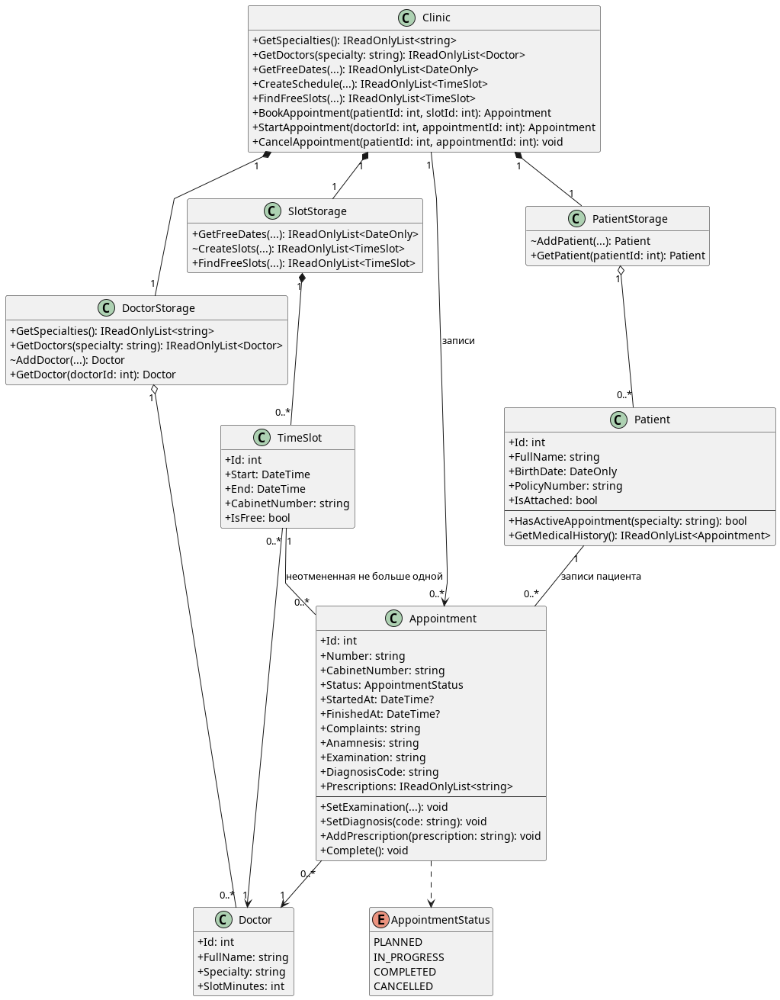
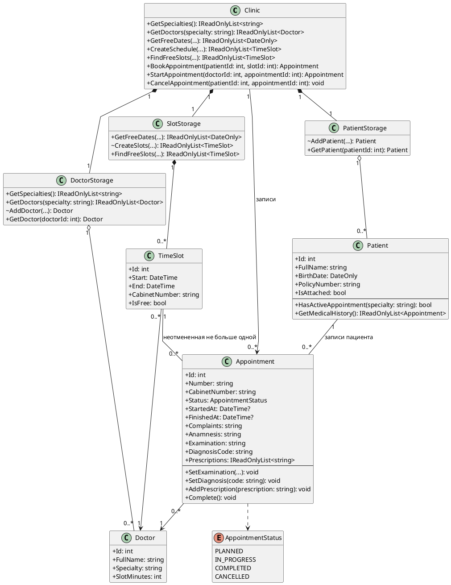

# Диаграмма классов ИС «ПолиКлик»

Показано ядро из `src/PoliClick`: запись пациента и ведение приема. На диаграмме оставлены основные свойства и методы; параметры части методов сокращены до `...`. Медицинская история пациента состоит из завершенных `Appointment`.

```plantuml
@startuml classes-all
skinparam classAttributeIconSize 0
skinparam linetype polyline
hide empty members

class Clinic {
  + GetSpecialties(): IReadOnlyList<string>
  + GetDoctors(specialty: string): IReadOnlyList<Doctor>
  + GetFreeDates(...): IReadOnlyList<DateOnly>
  + CreateSchedule(...): IReadOnlyList<TimeSlot>
  + FindFreeSlots(...): IReadOnlyList<TimeSlot>
  + BookAppointment(patientId: int, slotId: int): Appointment
  + StartAppointment(doctorId: int, appointmentId: int): Appointment
  + CancelAppointment(patientId: int, appointmentId: int): void
}

class PatientStorage {
  ~ AddPatient(...): Patient
  + GetPatient(patientId: int): Patient
}

class DoctorStorage {
  + GetSpecialties(): IReadOnlyList<string>
  + GetDoctors(specialty: string): IReadOnlyList<Doctor>
  ~ AddDoctor(...): Doctor
  + GetDoctor(doctorId: int): Doctor
}

class Patient {
  + Id: int
  + FullName: string
  + BirthDate: DateOnly
  + PolicyNumber: string
  + IsAttached: bool
  --
  + HasActiveAppointment(specialty: string): bool
  + GetMedicalHistory(): IReadOnlyList<Appointment>
}

class Doctor {
  + Id: int
  + FullName: string
  + Specialty: string
  + SlotMinutes: int
}

class SlotStorage {
  + GetFreeDates(...): IReadOnlyList<DateOnly>
  ~ CreateSlots(...): IReadOnlyList<TimeSlot>
  + FindFreeSlots(...): IReadOnlyList<TimeSlot>
}

class TimeSlot {
  + Id: int
  + Start: DateTime
  + End: DateTime
  + CabinetNumber: string
  + IsFree: bool
}

class Appointment {
  + Id: int
  + Number: string
  + CabinetNumber: string
  + Status: AppointmentStatus
  + StartedAt: DateTime?
  + FinishedAt: DateTime?
  + Complaints: string
  + Anamnesis: string
  + Examination: string
  + DiagnosisCode: string
  + Prescriptions: IReadOnlyList<string>
  --
  + SetExamination(...): void
  + SetDiagnosis(code: string): void
  + AddPrescription(prescription: string): void
  + Complete(): void
}

enum AppointmentStatus {
  PLANNED
  IN_PROGRESS
  COMPLETED
  CANCELLED
}

Clinic "1" *-- "1" SlotStorage
Clinic "1" *-- "1" PatientStorage
Clinic "1" *-- "1" DoctorStorage
PatientStorage "1" o-- "0..*" Patient
DoctorStorage "1" o-- "0..*" Doctor
Clinic "1" --> "0..*" Appointment : записи
SlotStorage "1" *-- "0..*" TimeSlot
Patient "1" -- "0..*" Appointment : записи пациента
TimeSlot "0..*" --> "1" Doctor
Appointment "0..*" --> "1" Doctor
TimeSlot "1" -- "0..*" Appointment : неотмененная не больше одной
Appointment ..> AppointmentStatus

@enduml
```
