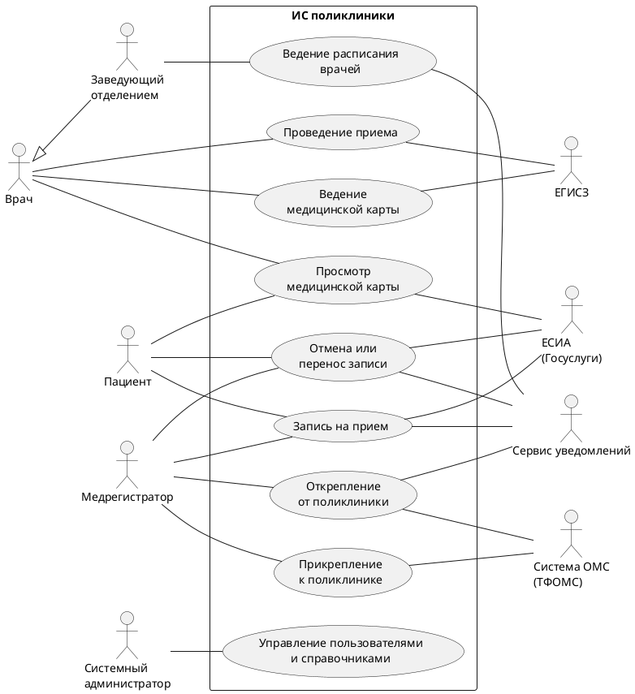
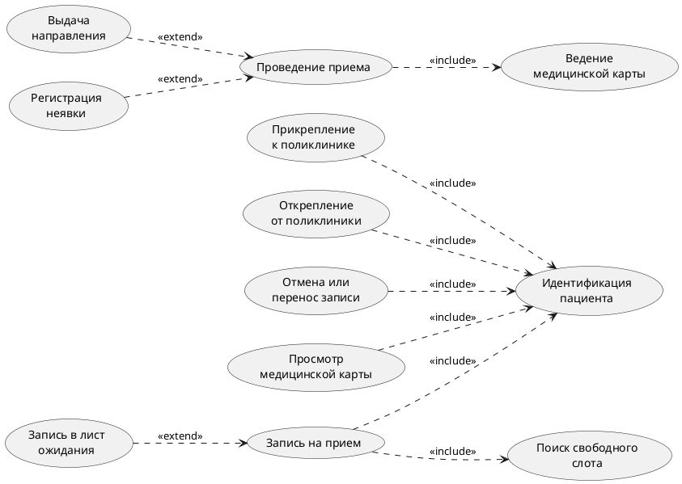

# Диаграмма прецедентов UML для ИС поликлиники
## Даты внесения изменений
| Версия | Дата | Описание | Автор |
--- | --- | --- | --- |
| Черновой начальный вариант | 19 сентября, 2026 | Первый черновой вариант. Будет уточнен на стадии развития | Команда 3, БСБО-11-24 |

## Основные прецеденты

Рис. Прецеденты 1. Диаграмма прецедентов ИС поликлиники

## Отношения include и extend

Общие и необязательные части сценариев вынесены на отдельную диаграмму, чтобы не загромождать основную.

Рис. Прецеденты 2. Отношения include и extend

Условия расширения:
- «Запись в лист ожидания» выполняется, если свободных слотов к нужному врачу нет.
- «Выдача направления» выполняется, если по итогам приема нужна консультация специалиста или исследование.
- «Регистрация неявки» выполняется, если пациент не пришел на прием (ПРАВ14).

## Актеры

| Актер | Роль |
--- | --- |
| Пациент | Записывается на прием, отменяет или переносит запись, смотрит свою медицинскую карту |
| Медрегистратор | Прикрепляет и открепляет пациентов, записывает на прием при личном обращении и по телефону |
| Врач | Проводит прием, ведет медицинскую карту. Вне приема тоже работает с картой, например вносит исправление в подписанную запись (ПРАВ17), поэтому связан с «Ведением медицинской карты» напрямую |
| Заведующий отделением | Составляет расписание врачей отделения. Сам тоже врач и может вести прием, поэтому на диаграмме наследует актера «Врач» |
| Системный администратор | Управляет учетными записями сотрудников, их ролями и справочниками |
| Система ОМС (ТФОМС) | Подтверждает действие полиса при прикреплении (ПРАВ3), принимает сведения о прикреплении и откреплении, сообщает, если пациент прикрепился к другой поликлинике (ПРАВ20) |
| ЕСИА (Госуслуги) | Подтверждает личность пациента при входе на портал: для записи, отмены или переноса записи и просмотра медицинской карты |
| Сервис уведомлений | Отправляет пациенту SMS и push-уведомления о записи, отмене записи, откреплении (ПРАВ4) и изменении расписания (ПРАВ21), напоминает о приеме |
| ЕГИСЗ | Принимает СЭМД о завершенном приеме и об исправлениях записей в ЭМК (ПРАВ19) |

## Прецеденты

Прецеденты упорядочены по убыванию риска реализации.

| № | Прецедент | Основной актер | Риск | Частота | Почему такой риск |
--- | --- | --- | --- | --- | --- |
| 1 | Запись на прием | Пациент, Медрегистратор | Высокий | Постоянно | Много пациентов одновременно претендуют на одни и те же слоты, нельзя допустить двойную запись. Зависит от ЕСИА и сервиса уведомлений, работает через несколько каналов: портал, приложение, инфомат, регистратура |
| 2 | Проведение приема | Врач | Высокий | Постоянно | Меняет статус записи, создает запись в ЭМК с подписью УКЭП, передает СЭМД в ЕГИСЗ |
| 3 | Ведение медицинской карты | Врач | Высокий | Постоянно (в составе приема) | Врачебная тайна, разграничение доступа, подписанные записи нельзя изменять (ПРАВ17, ПРАВ18) |
| 4 | Прикрепление к поликлинике | Медрегистратор | Средний | Ежедневно | Зависит от доступности ТФОМС, нужно проверять прикрепление к другой поликлинике (ПРАВ1, ПРАВ2) |
| 5 | Ведение расписания врачей | Заведующий отделением | Средний | Еженедельно | Изменение расписания затрагивает уже существующие записи пациентов, их нужно перенести и уведомить пациентов (ПРАВ21) |
| 6 | Отмена или перенос записи | Пациент, Медрегистратор | Средний | Ежедневно | Освободившийся слот нужно предложить листу ожидания (ПРАВ11) |
| 7 | Открепление от поликлиники | Медрегистратор | Низкий | Редко | Нужно отменить будущие записи, сохранить ЭМК и передать сведения в ТФОМС (ПРАВ4, ПРАВ20) |
| 8 | Просмотр медицинской карты | Пациент, Врач | Низкий | Ежедневно | Только чтение, но с проверкой прав доступа |
| 9 | Управление пользователями и справочниками | Системный администратор | Низкий | Редко | Типовая функция |

Самые частые прецеденты, «Запись на прием» и «Проведение приема», описаны подробно отдельно.
