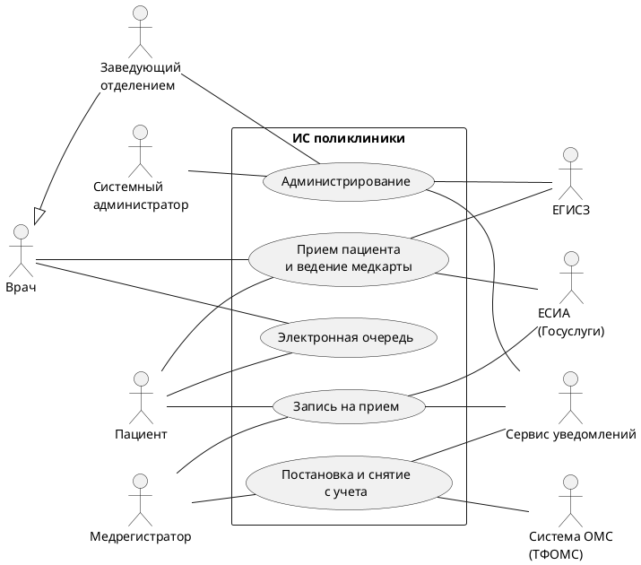
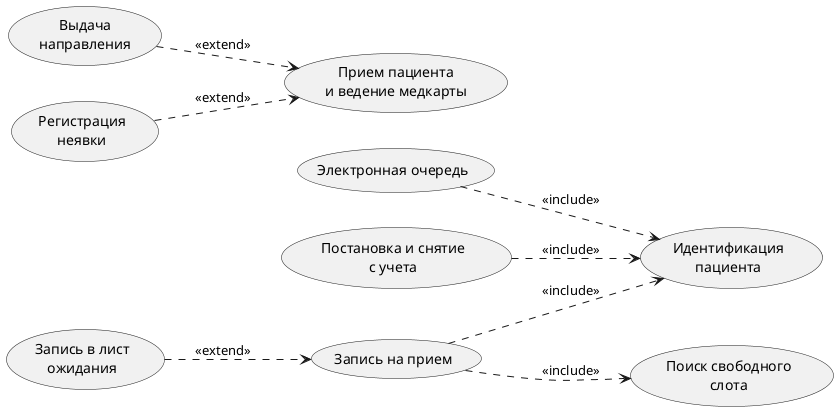

# Диаграмма прецедентов UML для ИС поликлиники

## Основные прецеденты

```plantuml
@startuml
skinparam packageStyle rect
left to right direction

together {
:Врач:
:Заведующий\nотделением:
}
:Пациент:
:Медрегистратор:
:Системный\nадминистратор:

:Заведующий\nотделением: -up-|> :Врач:

package "ИС поликлиники" {

(Администрирование)
(Прием пациента\nи ведение медкарты)
(Электронная очередь)
(Запись на прием)
(Постановка и снятие\nс учета)

}

:Пациент: -- (Запись на прием)
:Пациент: -- (Электронная очередь)
:Пациент: -- (Прием пациента\nи ведение медкарты)

:Медрегистратор: -- (Запись на прием)
:Медрегистратор: -- (Постановка и снятие\nс учета)

:Врач: -- (Электронная очередь)
:Врач: -- (Прием пациента\nи ведение медкарты)

:Заведующий\nотделением: -- (Администрирование)
:Системный\nадминистратор: -- (Администрирование)

:Система ОМС\n(ТФОМС):
:ЕСИА\n(Госуслуги):
:Сервис уведомлений:
:ЕГИСЗ:

(Постановка и снятие\nс учета) -- :Система ОМС\n(ТФОМС):

(Запись на прием) -- :ЕСИА\n(Госуслуги):
(Прием пациента\nи ведение медкарты) -- :ЕСИА\n(Госуслуги):

(Запись на прием) -- :Сервис уведомлений:
(Постановка и снятие\nс учета) -- :Сервис уведомлений:
(Администрирование) -- :Сервис уведомлений:

(Прием пациента\nи ведение медкарты) -- :ЕГИСЗ:
(Администрирование) -- :ЕГИСЗ:

@enduml
```

Рис. Прецеденты 1. Диаграмма прецедентов ИС поликлиники

Табло электронной очереди у кабинетов входит в состав ИС поликлиники, а не является внешней системой, поэтому актером оно не показано.

## Отношения include и extend

Общие и необязательные части сценариев вынесены на отдельную диаграмму, чтобы не загромождать основную.

```plantuml
@startuml
skinparam packageStyle rect
left to right direction

(Запись на прием) ..> (Идентификация\nпациента) : <<include>>
(Запись на прием) ..> (Поиск свободного\nслота) : <<include>>
(Запись в лист\nожидания) ..> (Запись на прием) : <<extend>>

(Электронная очередь) ..> (Идентификация\nпациента) : <<include>>

(Выдача\nнаправления) ..> (Прием пациента\nи ведение медкарты) : <<extend>>
(Регистрация\nнеявки) ..> (Прием пациента\nи ведение медкарты) : <<extend>>

(Постановка и снятие\nс учета) ..> (Идентификация\nпациента) : <<include>>

@enduml
```

Рис. Прецеденты 2. Отношения include и extend

Условия расширения:
- «Запись в лист ожидания» выполняется, если ни у одного врача нужной специальности нет свободных слотов на 14 дней вперед.
- «Выдача направления» выполняется, если по итогам приема нужна консультация специалиста или исследование.
- «Регистрация неявки» выполняется, если пациент не пришел на прием (ПРАВ14).

## Актеры

| Актер | Роль |
--- | --- |
| Пациент | Записывается на прием, отменяет или переносит запись, отмечает приход в инфомате и ждет вызова на табло, смотрит свою медицинскую карту |
| Медрегистратор | Ставит пациентов на учет и снимает с учета, записывает на прием при личном обращении и по телефону |
| Врач | Вызывает пациентов из электронной очереди, проводит прием, ведет медицинскую карту |
| Заведующий отделением | Составляет расписание врачей отделения. Сам тоже врач и может вести прием, поэтому на диаграмме наследует актера «Врач» |
| Системный администратор | Управляет учетными записями сотрудников, их ролями и справочниками |
| Система ОМС (ТФОМС) | Подтверждает действие полиса при постановке на учет (ПРАВ3), принимает сведения о прикреплении и откреплении, сообщает, если пациент прикрепился к другой поликлинике (ПРАВ20) |
| ЕСИА (Госуслуги) | Подтверждает личность пациента при входе на портал: для записи на прием и просмотра медицинской карты |
| Сервис уведомлений | Отправляет пациенту SMS и push-уведомления о записи, отмене и переносе записи, снятии с учета (ПРАВ4) и изменении расписания (ПРАВ21), напоминает о приеме |
| ЕГИСЗ | Принимает СЭМД о завершенном приеме и об исправлениях записей в ЭМК (ПРАВ19). Передает справочники НСИ (МКБ-10, специальности, должности) и принимает сведения о сотрудниках в регистр медицинских работников (ПРАВ22) |

## Прецеденты

Прецеденты упорядочены по убыванию риска реализации. Каждый прецедент подробно описывается в своей папке.

| № | Прецедент | Что входит | Основной актер | Риск | Частота | Почему такой риск |
--- | --- | --- | --- | --- | --- | --- |
| 1 | Запись на прием | Запись, отмена и перенос записи, лист ожидания | Пациент, Медрегистратор | Высокий | Постоянно | Много пациентов одновременно претендуют на одни и те же слоты, нельзя допустить двойную запись. Зависит от ЕСИА и сервиса уведомлений, работает через портал, приложение, инфомат и регистратуру. Освободившийся слот нужно предложить листу ожидания (ПРАВ11) |
| 2 | Прием пациента и ведение медкарты | Проведение приема, записи в медкарту, просмотр медкарты врачом и пациентом, направления, неявка | Врач | Высокий | Постоянно | Меняет статус записи, создает запись в ЭМК с подписью УКЭП, передает СЭМД в ЕГИСЗ (ПРАВ15, ПРАВ19). Врачебная тайна: разграничение доступа, подписанные записи нельзя изменять (ПРАВ17, ПРАВ18) |
| 3 | Электронная очередь | Отметка о приходе, вызов пациента в кабинет, табло у кабинета. Неявку очередь только показывает, отмечает ее врач в «Приеме пациента» (расширение «Регистрация неявки») | Пациент, Врач | Средний | Постоянно | Работает в реальном времени: табло должны обновляться сразу после вызова. Нужно учитывать опоздавших и пациентов без отметки о приходе. На табло нельзя выводить персональные данные пациента |
| 4 | Постановка и снятие с учета | Прикрепление и открепление пациента, заведение медкарты | Медрегистратор | Средний | Ежедневно | Зависит от доступности ТФОМС, нужно проверять прикрепление к другой поликлинике (ПРАВ1, ПРАВ2). При снятии с учета нужно отменить будущие записи и сохранить медкарту (ПРАВ4, ПРАВ20) |
| 5 | Администрирование | Расписание врачей, учетные записи и роли сотрудников, справочники | Заведующий отделением, Системный администратор | Средний | Еженедельно | Изменение расписания затрагивает уже существующие записи пациентов (ПРАВ21). Ошибка в ролях открывает доступ к врачебной тайне (ПРАВ18). Справочники нужно синхронизировать с ЕГИСЗ, а данные о сотрудниках передавать в регистр медицинских работников (ПРАВ22) |
