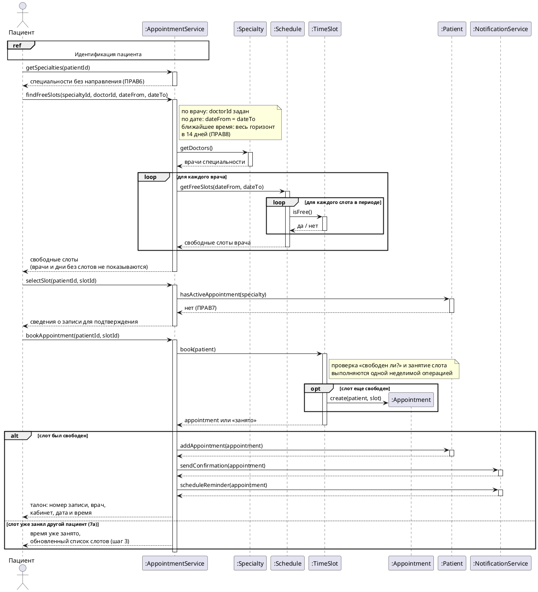

# Диаграмма последовательности «Запись на прием»

Основной успешный сценарий прецедента [«Запись на прием»](Запись%20на%20прием.md), шаги 1–8, и расширение 7а: слот успели занять, пока пациент подтверждал запись. Отмена, перенос и остальные расширения описаны в тексте прецедента.

Рис. Запись на прием 1. Диаграмма последовательности основного успешного сценария

## Системные операции

| Шаг сценария | Операция | Что делает |
| --- | --- | --- |
| 1 | включаемый прецедент «Идентификация пациента» | Пациент входит через ЕСИА, система определяет, кто он |
| 2 | `getSpecialties(patientId)` | Возвращает специальности, к которым пациент может записаться без направления (ПРАВ6) |
| 3 | `findFreeSlots(specialtyId, doctorId, dateFrom, dateTo)` | Ищет свободные слоты. Способ поиска (по врачу, по дате, ближайшее время) задается параметрами |
| 4–5 | `selectSlot(patientId, slotId)` | Проверяет, что у пациента нет активной записи к этой специальности (ПРАВ7), и возвращает сведения для подтверждения |
| 6–8 | `bookAppointment(patientId, slotId)` | Закрепляет слот, создает запись со статусом «запланирована», отправляет подтверждение и планирует напоминание о приеме |
